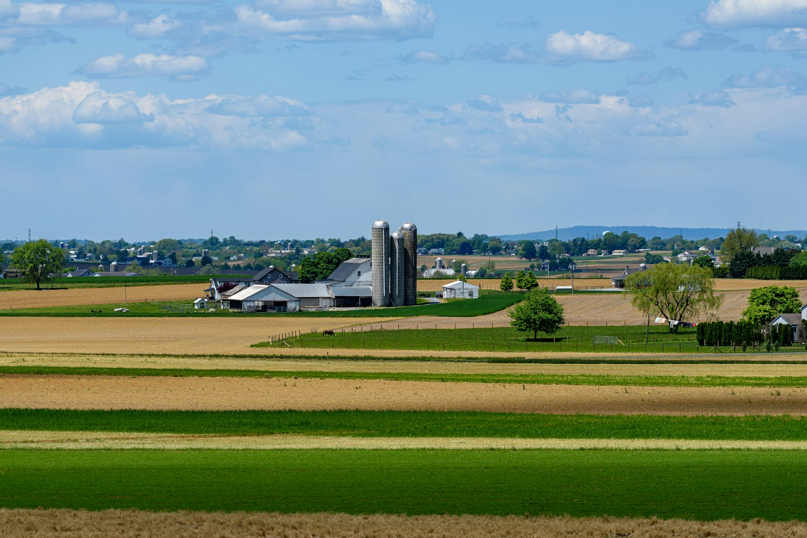

{fig-alt="Aerial view of farmland with grain silos next to segmented crop fields"}

## About the project

### Summary

Most research on climate change and agriculture focuses on how farmers directly respond to weather shocks, by adjusting crop choices, inputs, or land use. AdaptAgriChain starts from a different angle: farmers do not adapt in isolation. They operate within agricultural supply chains dominated by a small number of downstream firms (processors, retailers, and other intermediaries) whose market power and investment decisions shape how, and how well, agriculture can adapt to a changing climate.

This project studies how the structure of agri-food supply chains affects climate change impacts in the agricultural sector, and what this implies for agricultural and climate policy in France and the European Union. It combines tools from industrial organization and agricultural economics with detailed weather, climate, and firm-level financial data.

The project is led by [Loïc Henry](index.html) and funded by the French National Research Agency (ANR) as a JCJC (Jeunes Chercheuses et Jeunes Chercheurs) grant,
for 42 months starting on January 2026.

### Research axes

* **Market power and the distribution of weather shock costs**. This axis examines how market power among agro-industrial intermediaries affects the way the costs of weather shocks are shared between farmers and downstream firms, and whether concentrated markets leave farmers more exposed to climate risk. 

* **Intermediary firms and long-term climate adaptation through crop relocation**. Adapting to climate change often means relocating crops to more suitable areas, but this depends on nearby processing and storage infrastructure. This axis studies how the willingness of intermediary firms to invest in such infrastructure, and the high fixed costs involved, affects farmers' ability to relocate production as the climate changes.

* **Policy design in concentrated agricultural markets**. <!-- This axis develops a spatial equilibrium model in which both intermediary firms' entry decisions and farmers' crop choices are endogenous, to evaluate the effectiveness of agricultural policies such as the Common Agricultural Policy, and to simulate the impact of climate change and policy interventions on French agriculture. -->

## Team

- [Loïc Henry](index.html)
- [Bertille Daran](https://bertilledaran.github.io/)
- [François Bareille](https://francoisbareille.wordpress.com/)
- [Rémi Avignon](https://sites.google.com/view/remi-avignon)
- [Philippe Delacote](https://sites.google.com/view/philippedelacote/home)

## Funding

{width="180px" fig-alt="Logo of the French National Research Agency (ANR)"}

This project is funded by the French National Research Agency (ANR) under its JCJC (Jeunes Chercheuses et Jeunes Chercheurs) programme.
